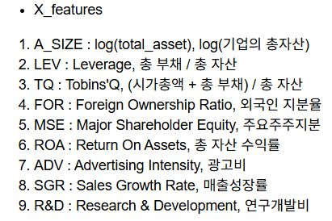
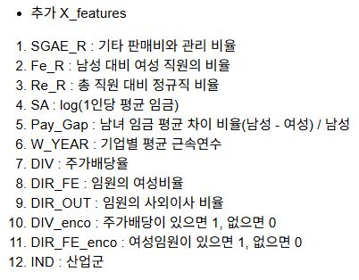
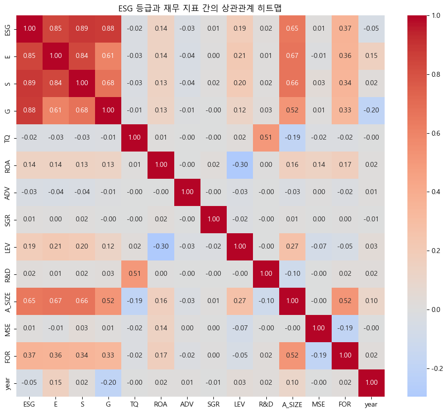
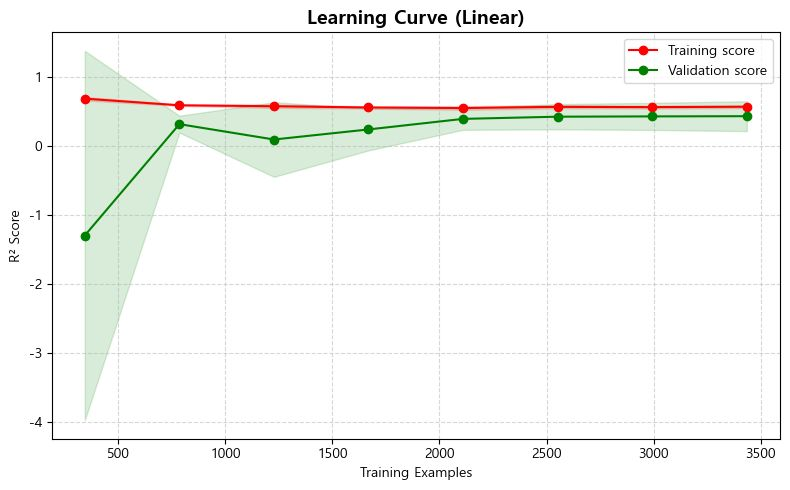
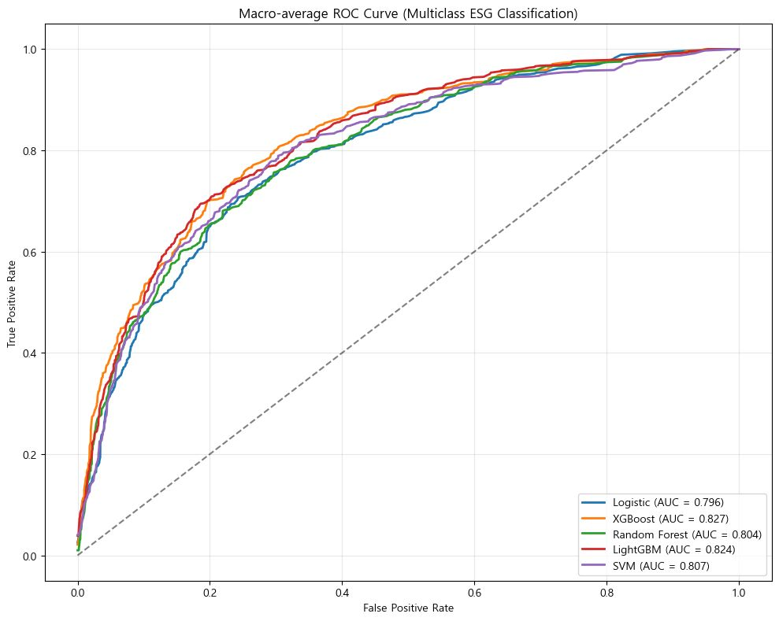
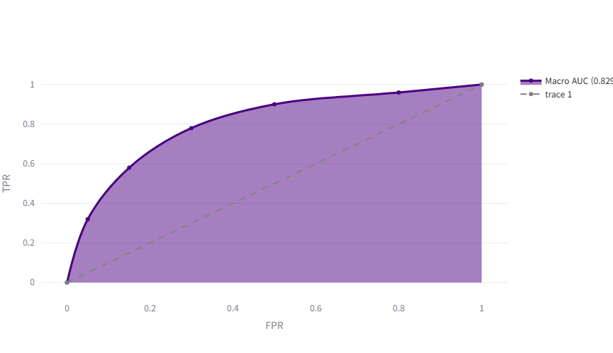

# 📊 재무 정보를 활용한 기업 ESG 등급 예측 모델 제작
**Predicting Corporate ESG Ratings Using Financial Information**

## 1. 프로젝트 개요 (Overview)
* **목표**: 한국 ESG 기준원의 평가 등급을 바탕으로 재무 지표와 연계한 등급 예측 모델 제작
* **배경**: 기존 선행 연구의 낮은 설명력($R^2$ 0.225)을 개선하고, 재무 지표가 기업 가치(ESG)에 미치는 영향을 정량적으로 입증하고자 함
* **참조논문**: 이재영, 차우창(2024) “머신러닝 모델을 활용한 ESG 활동과 기업 가치 분석”, 한국산업경영시스템학회지 47(4), 76-86.
* **개발 기간**: 2025.12 ~ 2026.01 (약 2주)
* **참여자**: 박현우 외 1명 (팀 프로젝트, my_role : Team Leader)

## 2. 사용 기술 (Tech Stack)
* **Language**: Python
* **Data Handling**: Pandas, NumPy
* **Visualization**: Matplotlib, Seaborn
* **Machine Learning**: Scikit-learn, Linear, Logistic, XGBoost, LightGBM, Random Forest, SVM
* **Environment**: Jupyter Notebook

## 3. 데이터 수집 및 전처리 (Data & EDA)
* **대상**: 평가 기업 731개 (기존 635개에서 확장)
* **주요 변수 (Features)**:
    * 재무 지표: 자산규모(Size), 부채비율(LEV), 외국인 지분율(FOR), 연구개발비(R&D) 등
    
    * **파생 변수 추가**: 정성적 요소를 반영하기 위해 '기타 판매비와 관리비', '남녀 임금 격차', '임원 여성 비율' 등 추가 수집
    

## 4. 모델링 및 성능 개선 (Modeling)
### 4-1. Base Model (다중회귀분석)

* **결과**: 설명력($R^2$) **0.440** 달성 (기존 논문 대비 약 2배 성능 향상)
* **X_features 추가**: 설명력($R^2$) **0.5717** 달성
* **한계**: $R^2$ 점수의 정체 및 회귀 분석의 한계점 도달 확인 (Learning Curve 분석)

### 4-2. Final Model (분류 모델 전환)
* **전략**: 회귀 모델에서 **다중 분류(Multi-class Classification)** 모델로 전환하여 실무적 활용도 제고
* **알고리즘 비교**: Logistic, XGBoost, Random Forest, SVM 등 비교 검증
* **최종 모델 선정**: **XGBoost** (가장 우수한 성능 기록)

* **Shap 분석**: feature별 영향력 분석
.png)
.png)

## 5. 핵심 성과 (Results)
* **최종 성능**: **ROC-AUC 0.823** 달성 (Base Model 대비 0.3 향상)
* **인사이트**:
    * 단순 재무 지표 외에 비재무적(정성적) 요소 변수의 중요성 확인
    * 자산 규모, 외국인 지분율 등이 ESG 등급에 주요한 양(+)의 상관관계 확인

## 6. 활용 방안 (Conclusion)
1. **투자 전략**: ESG 등급 예측을 통한 기업의 미래 투자 가치 평가
2. **리스크 관리**: 등급 하락 조기 예측을 통한 리스크 관리 지표 활용
3. **기업 컨설팅**: 등급 상승을 위한 구체적인 개선 지표(여성 임원 비율 등) 제안

## 7. 대시보드 (Dashboard)

---
*자세한 분석 과정과 코드는 상단의 `.ipynb` 파일 또는 첨부된 [PDF 포트폴리오](./PARK_Portfolio.pdf)를 참고해 주세요.*
