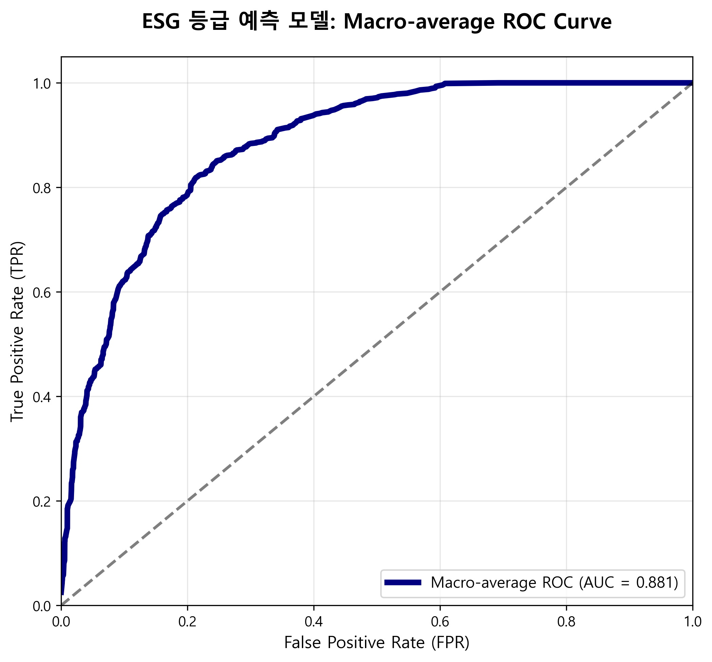
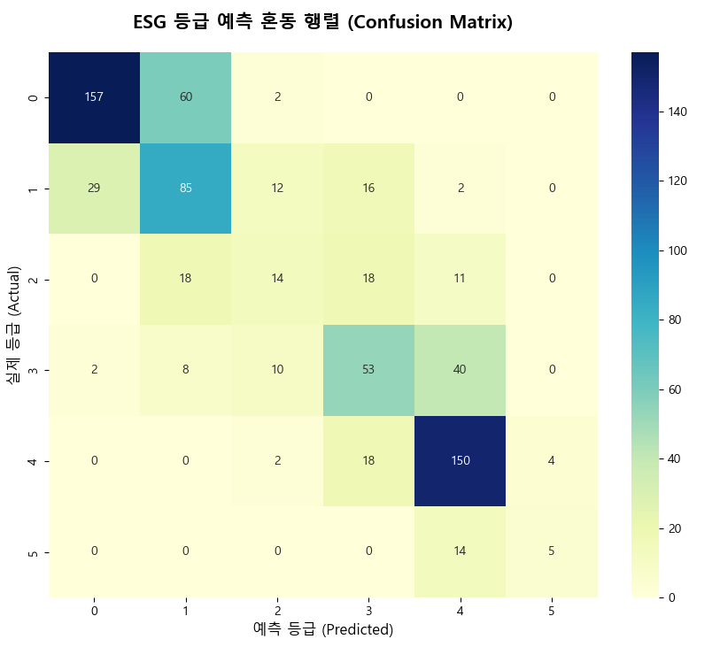

# 확장형 XGBoost 기반 ESG 등급 예측 모델

본 보고서는 기본 재무 지표에 회계적 통찰을 더한 신규 변수를 추가하여, 모델의 예측 성능과 비즈니스 해석력을 높인 고도화 과정을 담고 있습니다.

## 1. 신규 변수 설계 (Feature Engineering)
단순 재무 수치를 넘어 기업의 경영 맥락을 파악하기 위해 두 가지 핵심 변수를 설계했습니다.
- **`ESG_lag`**: 기업 경영의 일관성과 관성을 반영하기 위해 전년도 ESG 등급 점수를 변수로 활용.
- **`A_SIZE_FOR_inter`**: 기업 규모(`A_SIZE`)와 외국인 지분율(`FOR`)의 상호작용 변수를 통해 글로벌 자본 유치와 ESG 등급 간의 시너지 효과 반영.

## 2. 모델 성능 (Performance)
XGBoost Classifier를 활용하여 검증한 결과, 안정적인 예측 성능을 확인했습니다.

| 지표 (Metric) | 결과 (Value) |
| :--- | :---: |
| **전체 정확도 (Accuracy)** | **0.640** |
| **Macro F1-Score** | **0.530** |
| **Macro AUC** | **0.881** |

## 3. 분석 결과 시각화

### 📊 Macro-average ROC Curve
모델의 종합적인 판별 능력을 나타내는 ROC 커브입니다. (Macro AUC 0.881)

### 🧩 Confusion Matrix (혼동 행렬)
실제 등급과 예측 등급 간의 일치도를 나타내는 혼동 행렬입니다. 어떤 등급에서 오차가 발생하는지 한눈에 확인할 수 있습니다.

## 4. 전략적 제안
- **데이터 기반 의사결정**: 전년도 등급의 관성을 바탕으로, 재무 지표 변동에 따른 등급 하락 리스크 선제적 관리 제안.
- **지배구조 강화**: 외국인 투자 비중이 높은 기업일수록 지배구조 투명성 개선 시 등급 상승 효과가 극대화됨을 시사.

---
**분석가**: 민선아 (Seona Min)
**기술 스택**: Python, XGBoost, Scikit-learn, Pandas, Matplotlib
